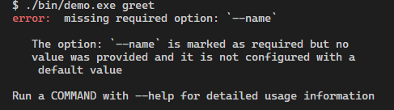

# Gommander (go-commander)

<p align="center">


</p>

A commander package for creating CLIs in Go. This package aims to be a complete solution for command-line argument parsing by providing you with an easy-to-use and extensible api but without compromising speed.

Features of this package include:

- Support for POSIX-compliant flags
- Color printing
- Easily extensible API
- Fast and lightweight parser
- Subcommands nesting
- Automatic help generation

## API Overview


## Index

- [Gommander](#gommander-go-commander)
  - [Installation](#installation)
  - [Quick Start](#quick-start)
  - [Subcommands](#subcommands)
  - [Arguments](#arguments)
  - [Flags](#flags)
  - [Options](#options)
  - [App Settings and Events](#settings-and-events)
  - [App Themes and UI](#themes-and-ui)
  - [Command Callbacks](#command-callbacks)
  - [Error Handling](#error-handling)
  - [Public Formatter Interface](#public-formatter-interface)

## Installation

To add the package to your go project, execute the following command:

```bash
go get -u github.com/ndaba1/gommander
```

## Quick Start

Gettting started with gommander is quite easy. Create an instance of `gommander.App()` which is the internal representation of your CLI program to which you add [subcommands](#subcommands), [arguments](#arguments), [flags](#flags) and [options](#options). The following is a quick example:

```go
package main

import (
  "fmt"

  "github.com/ndaba1/gommander"
)

func main() {
  app := gommander.App()

  app.Author("vndaba").
      Version("0.1.0").
      Help("A demo usage of gommander").
      Name("demo")

  app.Subcommand("greet").
      Argument("<name>", "The name to greet").
      Help("A simple command that greets the provided name").
      Option("-c --count <number>", "The number of times to greet the name")

  app.Parse()
}

```

When the help flag is invoked on the above example, the following output gets printed out:

```bash

A demo usage of gommander

Usage:
    demo [FLAGS] <SUBCOMMAND>

Flags:
    -h, --help        Print out help information
    -v, --version     Print out version information

Subcommands:
    greet             A simple cmd that greets provided name

```

## Subcommands

Commands and subcommands are the gist of the package. The program's entry point is itself a command to which more subcommands may be nested. A new command can be created by the `gommander.NewCommand()` method, but you will rarely have to work with this method directly. Instead, the convention is first to create an app via the `gommander.App()` method, which is also a command marked as the program's entry point (the root cmd), then chain further subcommands to it.

```go
//...package declaration and imports
func main() {
    app := gommander.App()

    app.SubCommand("basic")
}
//...
```

The `.SubCommand()` method returns the newly created subcommand for further manipulation and customization such as adding [arguments](#arguments), [flags](#flags), [options](#options) or updating command metadata such as it description, etc.

You can also manipulate the fields of the root command, such as the program's author and the version, and even set the program's name to be different from the name of its binary. (This doesn't change the name of the actual binary, it only changes the name displayed to users when printing out help information).

```go
// ...
func main() {
    app := gommander.App()

    app.Help("A simple CLI app").
        Version("0.1.0").
        Author("vndaba")
}
// ...
```

Subcommands can have multiple aliases which are hidden by default, but you can this behavior can be modified easily, as shown:

```go
// ...
func main() {
    app := gommander.App()

    app.SubCommand("image").
        Help("A test subcmd").
        Alias("img").
        Alias("images")

    // to display the aliases
    app.Set(gommander.ShowCommandAliases, true)
}
// ...
```

The package also supports Subcommand Nesting. You can chain as many subcommands as you would like. The following is an example:

```go
// ...
func main() {
    app := gommander.App()

    image := app.SubCommand("image").Help("Manage images")

    image.SubCommand("ls").Help("List available images")
    image.SubCommand("build").Help("Build a new image")

    // ...
}
// ...
```

The `.SubCommand()` method is ergonomic and reduces function parameters nesting in your program. However, you could also use the `.AddSubCommand()` method to add a new subcommand. It is similar to the subcommand method, but instead of taking the name of the new command as input, it makes it an instance of an already created command, and instead of returning the newly created subcommand, it returns the command to which it is chained as so:

```go
// ...
func main() {
    app := gommander.App()

    app.AddSubCommand(
        gommander.NewCommand("first").Help("A basic subcommand"),
    ).AddSubCommand(
        gommander.NewCommand("second").Help("Another basic subcommand"),
    )
}
// ...
```

You could keep chaining subcommands using this method as shown. The `.SubCommand()` method invokes this one internally.

Throughout the package, you will also notice a similar pattern to other methods. For instance, you can create flags via the `.Flag()` method, but there also exists a `.AddFlag()` method which follows the same rules as the subcommand method counterpart. The same also applies for [options](#options) and [arguments](#arguments).

### Subcommand Groups

You can also add subcommands to groups. This may be done to change how they are printed when showing help. For this, the `.AddToGroup()` method may be used. An example of this is shown in the [subcommands](./examples/subcommands/subcommands.go) example.

## Arguments

Arguments are values passed to a command as input. You can also pass them to an option. For instance, in the demo example in the [quick start section](#quick-start), the greet subcommand takes in a name as input. The program is therefore expected to be run as follows:

```bash
./demo.exe greet John
```

Here, `John` is a value that is an instance of the `<name>` argument. Adding arguments to commands is fairly simple. You could either use the [.Argument()](#argument-method) method or the [.AddArgument()](#addargument-method) one.

### **Argument() method**

```go
// ...
func main() {
    app := gommander.App()

    app.Argument("<basic>", "Some basic argument")
}
// ...
```

Here, we see the value of the argument enclosed between angle brackets. **This means that the argument is required** and therefore, an error will be thrown if one is not passed to the program. Optional arguments are represented by square brackets: `[arg]`. The argument is marked as optional if neither the square or angle brackets are provided.
The `.Argument()` method takes in the value of the argument and its help string/description. Here are the acceptable forms for the argument value:
| Value | Semantics|
|:-----|:--------|
| `<arg>` | Argument is required |
| `<arg...>` | Argument is required and is variadic|
| `[arg]` | Argument is optional|
| `[arg...]` | Argument is optional but variadic if provided|

### **AddArgument() method**

```go
// ...
func main() {
    app := gommander.App()

    app.AddArgument(
        gommander.NewArgument("language").
            Required(true).
            Variadic(false).
            ValidateWith([]string{"ENGLISH", "SPANISH", "FRENCH", "SWAHILI"}).
            Default("ENGLISH").
            Help("The language to use"),
    )
}
// ...
```

The `.AddArgument()` method, while more verbose, provides more flexibility in defining arguments. It ought to be used when defining more complex arguments. The `gommander.NewArgument()` returns an instance of an Argument to which you can chain more methods. Most of the methods are axiomatic and you can deduce their functionality from their names.
The `.ValidateWith()` method sets valid_values for an argument. If the value passed is not one of those values, a well-described error is thrown by the program and printed out.
The `.ValidatorFunc()` method is similar to the `ValidateWith()` method but instead takes in a function that accepts a string as the input to perform custom validation on and returns an error instance or nil depending on the value.
The `.Default()` method sets a default value for an argument. The default value is used if the argument is required, but the user passed no value.

An example of the above-discussed methods is shown below:

```go
// ...
func main() {
    app := gommander.App()

    app.AddArgument(
        gommander.
            NewArgument("<language>").
            ValidateWith([]string{"ENGLISH", "SPANISH", "SWAHILI"}).
            ValidatorFunc(func(s string) error {
                if strings.HasPrefix(s, "X") {
                    return errors.New("values cannot begin with X")
                }
                return nil
            }).
            Default("ENGLISH"),
    )
}
// ...
```

Note: it is unconventional for the `ValidateWith()` and `ValidatorFunc()` method to be set on a single argument. **One of them will take precedence over the other.**

Arguments can also be passed to options. This is discussed in depth in the [options](#options) section

## Flags

Flags are values prefixed with either a `-` in their short form or `--` in their long form. Adding a flag to an instance of command is simple. You can achieve it in one of two ways:

- The `.Flag()` method:

```go
// ...
func main() {
    app := gommander.App()

    app.Flag("-V --verbose", "A flag for verbosity")
}
// ...
```

- The `.AddFlag()` method:

```go
// ...
func main() {
    app := gommander.App()

    app.AddFlag(
        gommander.NewFlag("verbose").
            Short('V').
            Help("A flag for verbosity").
            Global(true),
    )
}
// ...
```

When a flag is set as global, it will propagate to all the app subcommands.
The parser also supports POSIX flag syntax; therefore, if a command contains flags, say `-i`, `-t`, `-d`, instead of passing the flags individually to the program, users can combine the flags as `itd`.

## Options

Options are simply flags that take in a value as input. There are also two ways to declare options:

- The `.Option()` method

```go
// ...
func main() {
    app := gommander.App()

    app.Option("-p --port <port-number>", "The port number to use")
}
// ...
```

- The `.AddOption()` method:

```go
// ...
func main() {
    app := gommander.App()

    app.AddOption(
        gommander.NewOption("port").
            Short('p').
            AddArgument(
                gommander.NewArgument("<port-number>").
                    Default("9000"),
            ),
    )
}
// ...
```

When adding an argument, you can either use the `.Argument()` method or the `.AddArgument()` one.
Supported option syntaxes are:

- `-p 80`
- `--port 80`
- `--port=80`

## Settings and Events

The default behavior of the program can be easily modified or even overridden. You can achieve this through settings and events.
The program settings are straightforward and can be accessed via the `Command.Set()` method. Settings configured via this method are simple boolean values and include:

```go
// ...
func main() {
    app := gommander.App()

    // .... app logic

    app.Set(gommander.IncludeHelpSubcommand, true).
        Set(gommander.DisableVersionFlag, true).
        Set(gommander.IgnoreAllErrors, false).
        Set(gommander.ShowHelpOnAllErrors, true).
        Set(gommander.ShowCommandAliases, true).
        Set(gommander.OverrideAllDefaultListeners, false)

    app.Parse()
}
// ...
```

The package also has the concept of events that are emitted by the app and can be reacted to by adding new listeners or even overriding the default listeners.

```go
// ...
func main() {
    app := gommander.App()

    // .... app logic

    app.On(gommander.OutputVersion, func(ec *gommander.EventConfig) {
        app := ec.GetApp()

       fmt.Printf("You are version: %v of %v which was authored by: %v", app.GetVersion(), app.GetName(), app.GetAuthor())
    })
}
// ...
```

The `.On()` method is used to register a new callback for a given event. This callback is defined as: `type EventCallback = func(*gommander.EventConfig)`. The `.On()` method adds the new callback after the default ones. If you wish to override the default behavior, use the `.Override()` method to register the callback.

Other event-related methods include:

- `Command.BeforeAll()`
- `Command.BeforeHelp()`
- `Command.AfterAll()`
- `Command.AfterHelp()`

## Themes and UI

Themes control the color palette used by the program. You can define your own theme or use predefined ones. The package uses `github.com/fatih/color` as a dependency for color functionality.
The package uses the concept of designations for theme functionality, i.e. `Keywords` are assigned one color, `Descriptions` another, `Errors` another and so forth.

Using a predefined theme is as shown below:

```go
// ...
func main() {
    app := gommander.App()

    // .... app logic

    app.UsePredefinedTheme(gommander.PlainTheme)
}
// ...
```

You can also create your theme. You will need to import the `github.com/fatih/color` package.

```go
app.Theme(
    gommander.NewTheme(color.FgGreen, color.FgBlue, color.FgRed, color.FgWhite, color.FgWhite),
)
```

The `NewTheme` method takes in values of type `ColorAttribute` defined in the `fatih/color` package. Here are examples of the said themes:

### The default app theme:


### The plain theme:

You can configure the app to use the plain theme as follows:

```go
// ...
    app.UsePredefineTheme(gommander.PlainTheme)
// ...
```


### The colorful theme:

```go
// ...
    app.UsePredefineTheme(gommander.ColorfulTheme)
// ...
```


### Custom-defined themes:

You can easily define your custom theme as shown below:

```go
package main

import (
    "github.com/ndaba1/gommander"
    "github.com/fatih/color"
)

func main() {
    app := gommander.App()

    app.Theme(
        gommander.
           NewTheme(color.FgYellow, color.FgCyan, color.FgMagenta, color.FgRed, color.FgWhite),
    )
}

```


## Command Callbacks

The package only serves one purpose, to parse command-line arguments. Command callbacks are defined to define what to do with the parsed arguments. There are simply functions of the type: `func(*gommander.ParserMatches)` that get invoked when a command is matched. If a callback is not defined for a subcommand and the subcommand gets checked, help information gets printed out as the fallback behavior.
The `Command.Action()` function defines these functions.

See an example of this [here](./examples/demo/demo.go).

## Error handling

Errors are handled directly by the package. When an error is encountered, the program `emits` an event corresponding to this error which the set event listeners then catch. The program has pre-defined error listeners out of the box, but they can be overriden if you so choose and handle the error in a custom way. However, the error handling is sufficient by default. This is how errors are printed out by default:



You can configure the program to print out help information when an error is encountered by setting the said setting to true as shown:

```go
// ...
func main() {
    app := gommander.App()

    // ...

    app.Set(gommander.ShowHelpOnAllErrors, true)
}
```

This will in turn cause errors to be displayed as follows:


When you define a custom event-listener for an error-event, the function takes in an `EventConfig` corresponding to the specified event. You can get specific information from this config. The following is an example:

```go
// ...
func main() {
    app := gommander.App()

    app.On(gommander.MissingRequiredArgument, func(ec *gommander.EventConfig) {
        args := ec.GetArgs()
        fmt.Printf("\nError: You are missing the following required argument: %v\n", args[0])
        os.Exit(ec.GetExitCode())
    })
}
// ...
```

There are a few things to note about the above example:

- The `EventConfig.GetArgs()` method returns a slice of different strings depending on the error event that was emitted, various events have been documented accordingly. In this case, there was only one string in the slice, which was the name of the missing argument
- When defining custom-listeners, the `Command.On()` method does not remove the default listener, it only adds a new one, which will get invoked after the default ones. If you wish to override the default listener completely, use the `Command.Override()` method.
- Different events have different exit codes that can be accessed via the `EventConfig.GetExitCode()` method.
- You can add multiple listeners for a single event

## Public Formatter Interface

The formatter used by the package for color printing also has a public interface, which means you can use it to print out colored content if you wish to.
By convention, the formatter functions on a basis of designations as explained in the [theme](#themes-and-ui) section. However, you can also pass a color directly to the formatter to use as shown below:

```go
package main

import (
  "fmt"

  "github.com/ndaba1/gommander"
  "github.com/fatih/color"
)

func main() {
  app := gommander.App()

  app.On(gommander.MissingRequiredArgument, func(pm *gommander.EventConfig) {
    // Use default theme or create your own
    fmter := gommander.NewFormatter(gommander.DefaultTheme())
    fmter.ColorAndPrint(*color.New(color.FgRed), fmt.Sprintf("\nMissing a required argument: `%v`\n", pm.GetArgs()[0]))
  })
}
```

Other public formatter methods include:

- `Formatter.Add()`
- `Formatter.AddAndPrint()`
- `Formatter.Print()`
- `Formatter.Color()`
- `Formatter.ColorAndPrint()`
